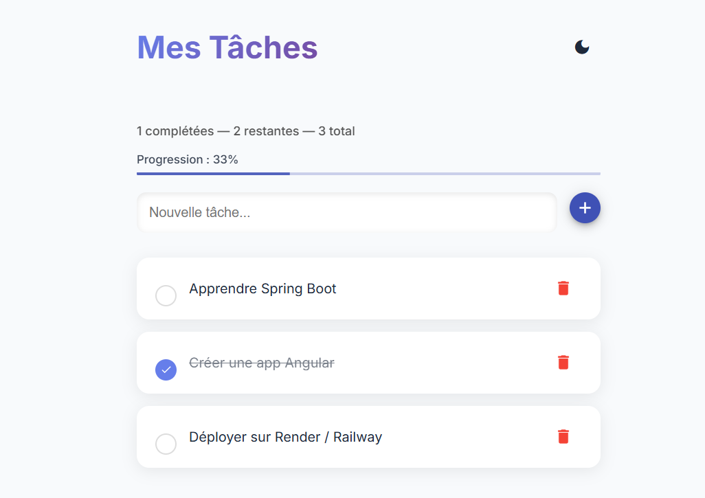
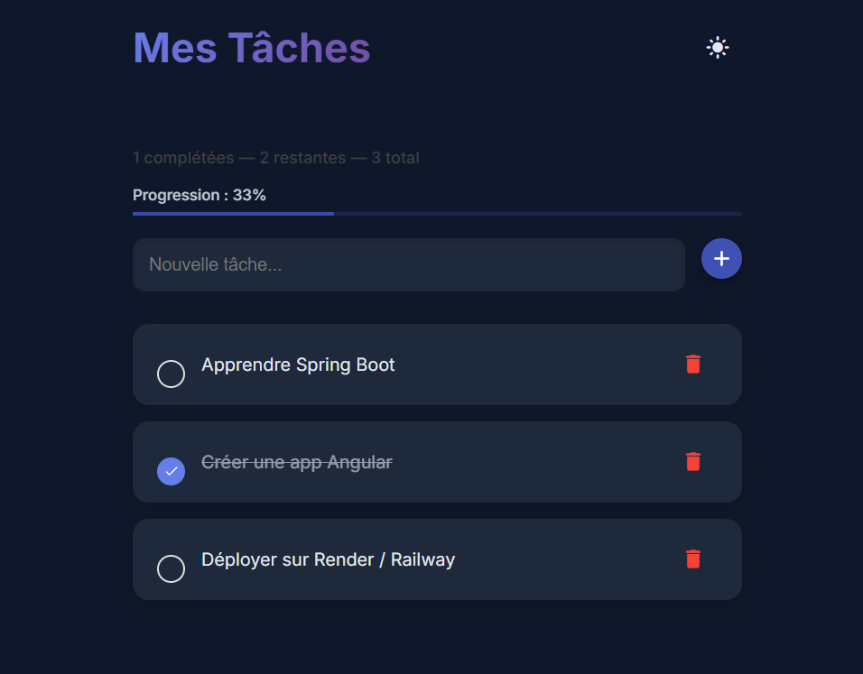

# todo-fullstack-2025
 ## Realisé par : **Hajar Slimani**

**Ajout d’un compteur dynamique et barre de progression (Angular Signals)**

J’ai ajouté un système dynamique permettant d’afficher en temps réel :

- Le nombre total de tâches

- Le nombre de tâches complétées

- Le nombre de tâches restantes

- Le pourcentage d’avancement

- Une barre de progression Angular Material synchronisée avec la liste

